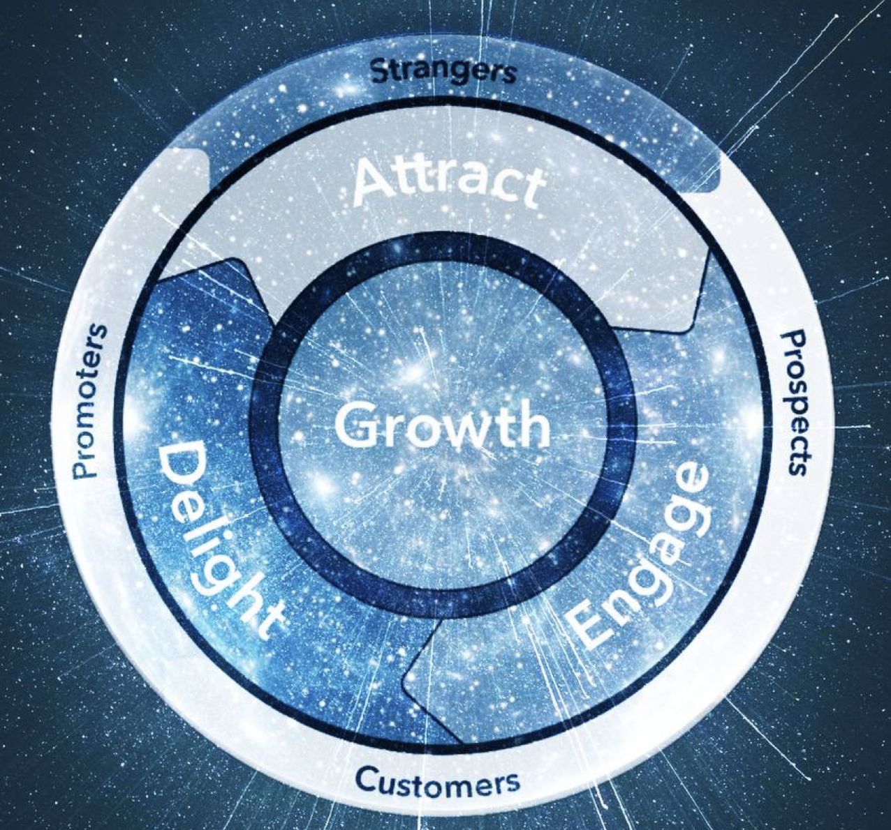

# Litepaper V1

## Introduction to the 100xCoin

Getting to over $1 Billion USD in market cap is a fairly straightforward process. We are following in the paths of our ancestors similar to how Facebook overtook MySpace. While our peers are stopping at the moon, $100x is aiming straight at the sun.

$100x is a deflationary token built on the Binance Smart Chain. The coin features 10% transaction fees split between burn functions, automatic liquidity pool generation, and a development wallet. This paper will discuss the benefits of this system, as well as foreshadow coming developments for the platform.

DYOR. This document is not financial advice.

## 100xCoin History

100xCoin originally founded and launched as $Elo by _Ken the Crypto_ in March of 2021. Ken has been teaching his followers how to buy and sell crypto since the first bull run in 2017. After he made his six-figures in one year trading cryptocurrencies, he started several businesses including a successful digital marketing agency.

But most importantly, he is the _first crypto influencer to develop and launch a coin on the Binance Smart Chain._ While other founders were scared to show their face, Ken showed how a doxxed owner can lead a community in DeFi.

Because of the unrivaled transparency in the development of the cryptocurrency, the $Elo community outgrew the tokenomics of the original coin and migrated to $100xCoin with better tokenomics for sustainable growth.

## Values

The community is still evolving but at the time of this writing 100xCoin values certain traits uncommon in DeFi.

* Transparency
* Sustainability 
* Education
* Supporting other Communities
* And Shilling. We really value shilling 😃 

But in all seriousness, the $100xCoin community has organically grown to a group of people who value the longevity of projects. Coming together on Live Streams with Ken has given the entire team a unique perspective into how cryptocurrencies are built, sold, and operate. What other community has held under a $10M market cap for a week just because it was better for long term growth of the project? I can't name one.

## Target Community Members

As money continues to flow out of centralized finance: banks, ATM's, piggybanks, $100x focuses on attracting two distinct groups to our community:

1. First time buyers who have not made a crypto trade before. We view it as our responsibility to educate new investors on the ins and outs of crypto trading and ask them to purchase coins responsibly. As always encouraging DYOR and only investing what you can afford to lose. 
2. Cryptocurrency experts that have made money on other high growth projects this year. We respect the gains other communities have made and welcome them into the 100x ecosystem. These members are valuable for educating newcomers, while also growing the value of the token. 

This combination of community members will provide 100x the needed peer group for coming use case plans.

## Tokenomics & Distribution

The starting $100x token supply is 935,312,500,000,000 and is distributed across wallet holders with no reserve for founders or developers. All $100x can be bought or sold freely.

The tokenomics of $100xCoin are:

* 3.5% burn per transaction
  * 2% automatic burn
  * 1.5% reserved for manual burns. 
* 2% automatic liquidity pool generation
* 1.5% marketing and development allocation

These tokenomics were built from community advice after reviewing other successful projects this year. These specific features are tuned for hyper growth of the $100x token. Each benefit will be discussed in turn.

A key change from popular projects is there is no redistribution of tokens. Redistribution does not actually reward holders in the way that most other tokens promote. By sending small amounts of tokens to wallet holders, the redistribution actually gives more "Selling Power" to holders.

This is why the $100x token burns 3.5% of transactions. In this way, holders are rewarded by a constant increase in token worth as the circulating supply decreases. Redistribution only is beneficial to the top 20 or so wallets, and does not help community growth in the long term

The liquidity pool function was taken from the successful project Safemoon. In order to create more liquidity in the PancakeSwap pairing, the automatic liquidity function taxes buyers and sellers 2% each transaction. 50% of this transaction is used to buy BNB. Then the other 50% of $100x is paired with the purchased BNB an added to the liquidity pool. Yes, it's just like Safemoon; but instead of a hard-fork like Safemars or Safewhatever, we have layered in tokenomics designed for growth of the $100x token and our community goals.

Which leads us to the most unique component of $100x, the 1.5% of funds reserved for marketing and development. At the time of this writing $100x is traded at roughly $1M in daily volume. This 1.5% represents $15k USD that we will use to market the growth of the token, and develop future platform features. We expect this to 10x on launch of the new token.

Compare this to Safemoon who has to fundraise each time they want to release new features. Growth is capped and speed is limited. These funds increase our likelihood to go parabolic before the bull-run ends, while also creating features for sustainable growth. _This wallet address will be shared with the community so that all transactions are transparent and clear._

At 100x we view marketing, sales, and development in a flywheel fashion. Roughly 40% of wallet funds will be used for marketing to attract new users, 20% will be used for a sales support team \(Telegram for now\), and 40% will be used for development of feature sets to be released in the coming months.

## Near-Term Roadmap

At this time the $100xCoin community is focused on the key activities needed for hyper growth. A high-level roadmap is shown below, and may change as the community suggests directions:

April \(After Launch\)

* Influencer campaigns
* Strategic partnerships
* Listing on Blockfolio, CMC, CoinGecko

May

* Announce First Use Case
* Celebrity Endorsements
* Channel Partners \(Clubhouse, New Outlets, etc.\)
* List on First Exchange\(s\)

June

* Release Use Case Beta
* Airdrop Features 
* Charity Partnerships 
  * Foundation Announcements

July

* July?  Y'all can barely think past April 12 😜

## Conclusion

It's important to remember that $100x started out as a meme coin with 0 utility planned. It is from the continued support of the community that we are going to develop beyond this level. At the same time there are the risks of adoption that come with any DeFi project. The team is mitigating those risks by focusing on values of transparency and sustainability when making decisions for all holders of $100x.

With the leadership of Ken the Crypto and the community at large, $100x has the opportunity to be the best run DAO on the Binance Smart Chain.

Hop in, we're going places 🧑‍🚀!

### Footnote

This roadmap is V1 and will grow alongside the community over the course of the year and lifetime of the project. Let's launch!

